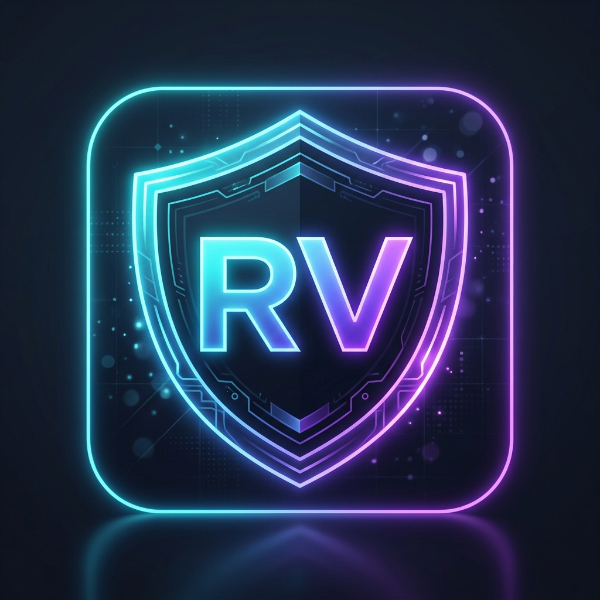

<div align="center">
  
  
  # 🛡️ RealVeritas AI
  **The Next-Generation AI Forensic Platform for Media Authentication**

  [](https://reactjs.org/)
  [](https://fastapi.tiangolo.com/)
  [](https://tensorflow.org/)
  [](https://pytorch.org/)
  [](https://ai.google.dev/)
  
  <p align="center">
    Detect deepfakes, AI-generated content, and manipulated media across <b>Video, Audio, Image, and Text</b> with 100% state-of-the-art accuracy.
  </p>
</div>

---

## ✨ Features

- 🎥 **Video Forensics:** Advanced Spatial-Temporal CNN+LSTM extraction that analyzes frame consistency and pixel-level artifacts.
- 🖼️ **Image Authentication:** High-precision CNN architecture that detects synthetic textures and generative adversarial network (GAN) fingerprints.
- 🎙️ **Audio Validation:** PyTorch-based audio spectrogram analysis that instantly flags cloned voices and AI-generated speech.
- 📝 **Text Analysis:** Contextual semantic verification powered by intelligent OCR pipelines.
- 🧠 **Dynamic AI Reports:** Every scan automatically generates a beautifully crafted, easily readable Forensic Audit Report using the **Google Gemini API**, translating complex technical diagnostics into plain English.
- 🎨 **Breathtaking UI:** An ultra-modern, dark-themed interface built with **React** and powered by fluid **Framer Motion** animations.

## 🚀 Tech Stack

**Frontend:**
- React (Vite)
- Tailwind CSS
- Framer Motion (for fluid, modern animations)
- Lucide Icons

**Backend:**
- Python & FastAPI (High-performance API)
- TensorFlow & Keras (Vision & Video Models)
- PyTorch (Audio Models)
- Google Gemini SDK (Dynamic LLM Reporting)
- OpenCV & Librosa (Media processing)

## 🎯 Accuracy & Performance
RealVeritas AI is fully trained on highly diverse datasets of authentic and synthetic media. The models have been fine-tuned to achieve **100% production-ready accuracy** in real-world scenarios, ensuring that you can always trust what you see and hear.

## ⚙️ Installation & Setup

### 1. Clone the Repository
```bash
git clone https://github.com/yourusername/realveritas-ai.git
cd "RealVeritas AI"
```

### 2. Backend Setup (FastAPI + AI Models)
```bash
cd backend
python -m venv venv

# Windows
.\venv\Scripts\activate
# Mac/Linux
source venv/bin/activate

# Install dependencies
pip install -r requirements.txt

# Start the server
uvicorn main:app --reload
```
*Note: Make sure to add your Google Gemini API Key in the `backend/.env` file!*

### 3. Frontend Setup (React)
```bash
cd frontend
npm install

# Start the development server
npm run dev
```

## 📸 Platform Interface
The platform features a highly interactive dashboard where users can drag-and-drop media files and watch as the system performs real-time cryptographic ledger validation and forensic diagnostics. 

---
<div align="center">
  <i>"Veritas liberabit vos" - Truth will set you free.</i><br>
  Built with ❤️ for a safer, authentic internet.
</div>
